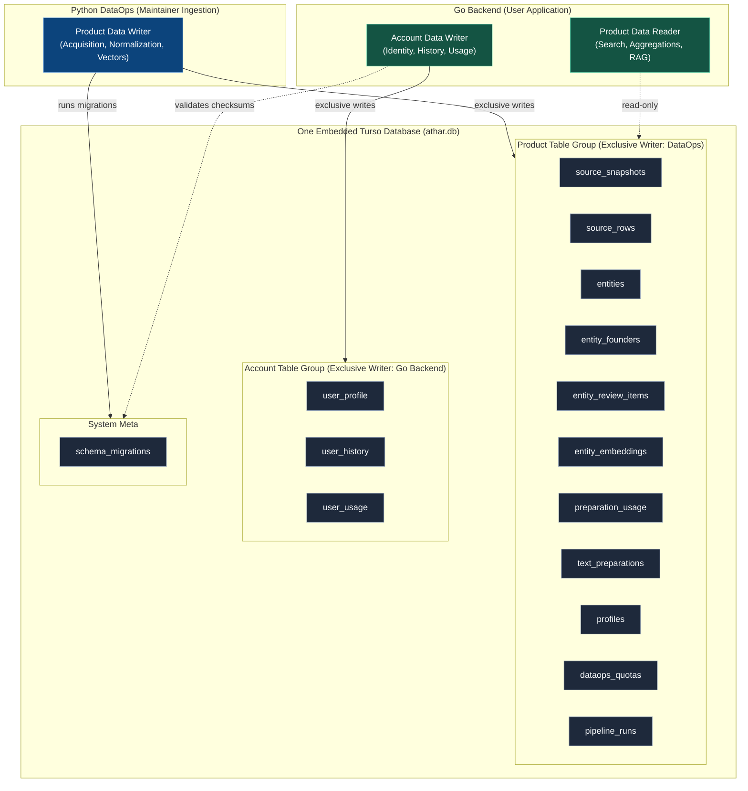
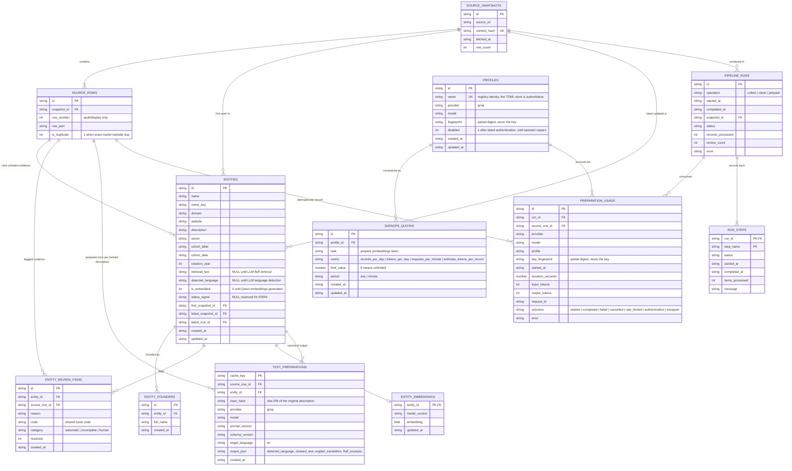
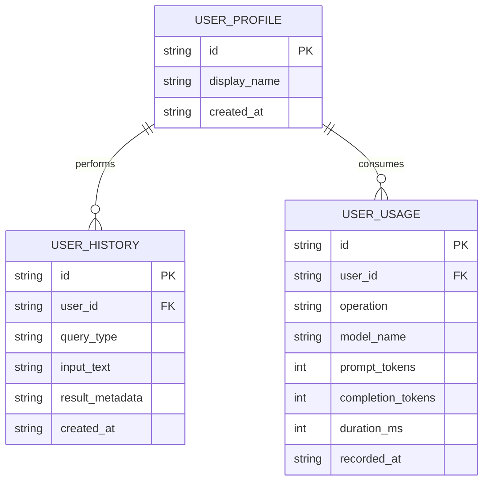

# Athar — Data Layer Architecture & Contracts

> Authority document for the shared Turso database (`athar.db`). Both Python DataOps and the Go Backend must strictly comply with the contracts defined here.

---

## 1. Operating Model & Table Ownership

The single local database file contains two completely segregated table domains. Dual-writer tables are strictly prohibited.

### Strict Ownership Rules
* **Product Tables:**
  * **DataOps:** Exclusive writer. Handles fetch, snapshot preservation, normalization, and vector embedding.
  * **Go Backend:** Read-only. Queries entities, runs full-text/vector searches, and aggregates landscape metrics.
* **Account Tables:**
  * **Go Backend:** Exclusive writer. Records local user identity, search history, and inference consumption.
  * **DataOps:** Zero access. DataOps never touches account tables.
* **Public Exports:**
  * Public datasets query product tables explicitly (`SELECT ... FROM entities`).
  * The database file itself is **never** copied directly to public releases.

---

## 2. Product Schema & Relationships (ERD)

All searchable attributes are indexed first-class columns. Duplicate rows are flagged `is_duplicate` on the derived layer and suppressed from default views, never deleted; `source_rows` serves as the sole citation evidence. Staged fields (`retrieval_text`, `detected_language`, `is_embedded`) are pre-allocated and post-filled cleanly: the Prepare operation fills `retrieval_text`/`detected_language` from a one-call language detection, fluff removal, and English translation, keyed to the exact description hash so unchanged input is never reprocessed. Review findings carry a shared `code`/`category` (automatic, incomplete, or human) so storage and UI classify issues identically; only unresolved human items count as "records needing review".

---

## 3. Account Schema & Relationships (ERD)

Local single-user workspace tables isolated from product data.

---

## 4. Database Engine & Concurrency Rules

1. **Embedded SQLite / Turso Pragmas:**
   * `PRAGMA foreign_keys = ON;` (enforce relational integrity on every connection).
   * `PRAGMA journal_mode = WAL;` (non-blocking reads while DataOps writes).
   * `PRAGMA busy_timeout = 5000;` (queue instead of throwing busy errors).
2. **Connection Lifecycles:**
   * DataOps writes are batch-scoped (`BEGIN IMMEDIATE`), keeping write locks minimal.
   * Go Backend product reads execute as read-only queries.

---

## 5. Migration Discipline

* **Shared Migration Files:** Idempotent, numbered `.sql` files in `migrations/`.
* **Checksum Verification:** Both Python and Go compute SHA-256 hashes of applied migrations; mismatch halts startup immediately.
