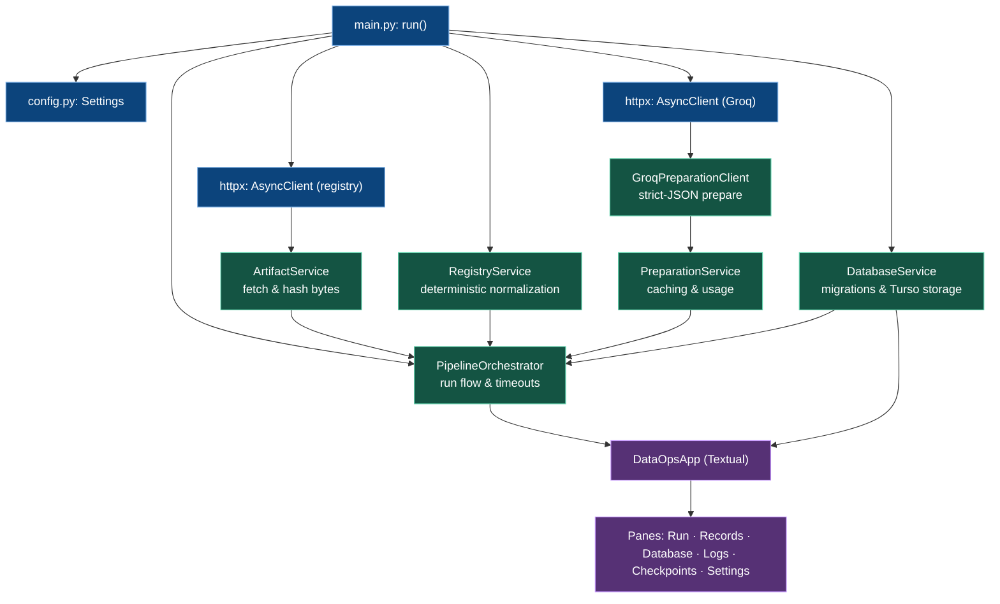
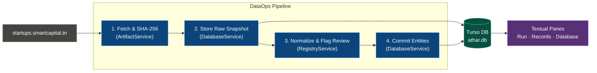

# DataOps architecture

- Current implementation: registry collection, offline cleaning of preserved evidence, Groq-backed Prepare text, and terminal inspection.
- Python with uv, Textual, and local embedded Turso (`pyturso` / `turso.aio`).

## File map

Paths below are relative to `src/athar_dataops/`.

| Path | Responsibility |
| --- | --- |
| `main.py`, `__main__.py` | Entry point, dependency construction, resource cleanup. |
| `config.py` | Validated settings and absolute database path. |
| `services/` | Acquisition, normalization, persistence, prepare (Groq), and pipeline coordination. |
| `schemas/` | Shared records, progress events, prepared output, issue classification, and query results. |
| `migrations/` | Numbered SQL migrations with recorded checksums. |
| `app.py` | Application shell, navigation, refresh events, and quit handling. |
| `ui/panes/` | Run, Records (`inspect_pane.py`), Database (`database_pane.py`), Logs, Checkpoints (`checkpoints_pane.py`), and Settings. |
| `ui/widgets/` | Artwork, progress, logs, metrics, and badges. |
| `services/groq.py` | HTTP transport for Groq preparation; never touches the database or UI. |
| `services/preparation.py` | Prepare run loop: candidates, caching, usage accounting, run history. |
| `ui/dialogs/` | Help and About dialogs. |
| `themes.py`, `app.tcss` | Theme roles, JSON rendering, layout, and interaction states. |
| `ui/arabic.py` | Display-only Arabic formatting. |
| `assets/` | Packaged terminal artwork. |

- Package configuration and lockfile: `pyproject.toml`, `uv.lock`.
- Test coverage and commands: [TEST_SUITE.md](TEST_SUITE.md).

## Dependency injection and lifetime

- `main.run()` constructs settings, initializes the database, and opens one HTTP client.
- It injects the client into `ArtifactService`, then passes collector, normalizer, database, and timeout into `PipelineOrchestrator`.
- `main.run()` opens a second, independent HTTP client for Groq and wraps it in `GroqPreparationClient` + `PreparationService`, injected into the orchestrator. The client holds one `_Profile` per Groq key (from `dataops/.env.profiles.toml`, falling back to a single legacy `GROQ_API_KEY`); preparation is disabled entirely when no key is configured.
- `PreparationService` seeds the `profiles` registry and free-tier `dataops_quotas` rows, then drives a per-run `_QuotaLedger` that selects the least-loaded eligible profile per attempt (excluding profiles that already spent a throttling round), smooths onto remaining daily envelopes across profiles, and stops visibly ("resume later"/"resume after reset") when rotation and budgets are exhausted. `401`/`403` persist `profiles.disabled=1`; throttling rounds cool the profile and rotate to the next.
- `DataOpsApp` receives the orchestrator, database, and settings; panes borrow those dependencies.
- The workspace is a `TabbedContent` subclass whose `TabPane.Focused` handling ignores hidden panes: programmatic tab switches survive Textual's focus restoration into the pane being left.
- The Checkpoints pane lists prepared records (stable checkpoint IDs and completion marking); the Database pane shows applied migrations and a confirmed, FK-safe wipe that clears tables in dependency order and re-runs migrations.
- One app session shares one database connection and HTTP client; Groq calls use their own client. `RegistryService` is stateless.
- Constructors make dependencies explicit; there is no DI container or service locator.
- `main.run()` also injects a `ProcessSampler` through the app into Run; samples cover the app process, not individual functions or the whole host.
- Textual workers handle asynchronous UI work on the application event loop.
- Quit waits for collection cancellation bookkeeping; the HTTP context closes its client and `finally` closes the database.
- Panes must not open their own connections or call nested `asyncio.run()`.

## Services and shared types

| Service | Owns |
| --- | --- |
| `ArtifactService` | HTTP fetching and hashing original bytes; returns `RegistrySnapshot`. |
| `RegistryService` | Deterministic field normalization and review reasons; returns `NormalizedRecord` values. |
| `GroqPreparationClient` | Single-credential Groq transport: strict-JSON one-call detection/translation/fluff removal, secret never surfaced. |
| `PreparationService` | Prepare run loop: candidate selection, per-description caching, usage accounting, run history. |
| `DatabaseService` | Migrations, evidence, run history, `run_steps` timing, transactional identity resolution, corpus reconcile (duplicate suppression, founder/description backfill), prepare storage/usage, and bounded queries. |
| `PipelineOrchestrator` | Collection, offline cleaning, and preparation sequences, overlap guard, progress, timeout, and failure/cancellation bookkeeping. |

- Services have no Textual dependency; UI consumes service methods and shared types.
- `schemas/registry.py`: source snapshots, normalized records, and evidence details.
- `schemas/pipeline.py`: stage/status enums, progress, and run results.
- `StageProgress.run_id` links live events to their run. `schemas/logs.py` keeps status separate from severity; both log views use `ui/log_format.py` for literal-safe, themed text.
- `schemas/database.py`: record and table pages, including pagination metadata.
- Frozen dataclasses carry results; Pydantic validates normalized records and configuration.
- Scope new types by domain and services by responsibility; extract shared behavior when a second consumer needs it.

## Collection and inspection flow

1. Run pane starts a worker; the orchestrator records a run and fetches the registry.
2. Original bytes are saved, read back, parsed, and preserved as source rows.
3. Normalization produces records and review reasons; identity resolution and derived writes commit together.
4. Progress callbacks update Run; completion refreshes Records and Database.
5. Inspection calls database query methods; widgets render records, evidence, and JSON.

- Failed parsing or processing retains evidence already saved; failed derived writes roll back.
- Cancellation and timeout update run history; cancellation propagates after bookkeeping.
- A shared database lock serializes access; transaction handling protects commit/rollback boundaries.
- The database browser exposes bounded table previews, not arbitrary SQL execution.
- Arabic shaping and JSON highlighting affect presentation only; stored originals remain intact.

## UI boundaries and working rules

- Panes own interaction and view state; widgets own reusable presentation; dialogs own focused overlays.
- `RunTimeline` is a focusable linked-circle pipeline; arrows stay local, while number keys keep their tab navigation role.
- Run samples CPU/RSS every second and at step boundaries; per-step CPU uses cumulative CPU-time deltas, memory peaks are sampled, and timers stop on completion/cancellation.
- Resource metrics and full logs are session-only. History shows stored step summaries/timings/counts; it never invents missing resource samples.
- Resolve/reconcile include the actual commit. Their terminal step status commits with the data, before optional UI reporting.
- Keep HTTP, normalization, identity rules, and SQL inside services.
- Use shared theme roles and JSON rendering helpers; pane-local CSS still exists alongside `app.tcss`.
- **DRY:** reuse schemas, normalization, widgets, and theme helpers; avoid copying domain logic into panes.
- **KISS:** keep explicit constructors, focused methods, and the fixed pipeline sequence.
- **YAGNI:** add abstractions for demonstrated needs; avoid speculative containers, plugin systems, or pipeline engines.
- Extend the responsible service and shared type first, then wire the UI and relevant tests.
- Preserve evidence and transaction guarantees; update this guide when structure or ownership changes.
