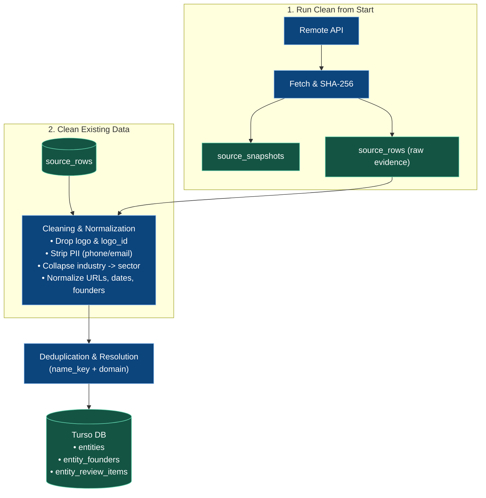

# Athar — DataOps Cleaning Pipeline

> Strict cleaning, normalization, and deduplication rules for the registry dataset.

---

## 1. The Two Operations

### Operation 1: Run Clean from Start
* **Trigger:** "Collect registry" button or scheduled ingest.
* **Flow:** Network fetch $\rightarrow$ SHA-256 check $\rightarrow$ store raw evidence in `source_rows` $\rightarrow$ clean & deduplicate $\rightarrow$ write canonical `entities`.
* **Within-run duplicates:** a row whose `(name_key, domain)` already appeared in the same run is flagged `is_duplicate=1` and queued (`Duplicate of row N`); the row itself is never deleted.

### Operation 2: Clean Existing Data
* **Trigger:** "Clean data" button or offline re-process.
* **Flow:** Read local `source_rows` $\rightarrow$ re-run cleaning rules & deduplication $\rightarrow$ update `entities`.
* **Reconcile pass:** flags exact `(name_key, domain)` duplicates across the whole corpus, backfills `entity_founders` and missing `entities.description` from preserved records, supersedes stale review items on shadow rows, and reports the open review count.
* **Zero Network:** 100% offline, idempotent, safe to run anytime; a repeated run reports 0 new changes.

---

## 2. Field Cleaning Rules

| Source Field | Action | Output Field | Rules |
|---|---|---|---|
| `logo`, `logo_id` | **Drop** | None | Blank placeholders; discarded completely |
| `phone`, `email` | **Drop** | None | PII policy; never stored in product entities |
| `industry` | **Collapse** | `entities.sector` | Identical to `sector`; merged into one column |
| `name` | **Normalize** | `entities.name` `entities.name_key` | Trim whitespace; NFC Unicode; casefold for lookup |
| `website` | **Normalize** | `entities.website` `entities.domain` | Strip scheme/`www`; lowercase; validate valid host |
| `desc` | **Normalize** | `entities.description` | Trim whitespace; preserve concrete product details |
| `label` | **Normalize** | `entities.cohort_label` `entities.cohort_date` | `MM/YYYY` parsed to ISO date (`YYYY-MM-01`) |
| `creation_year` | **Normalize** | `entities.creation_year` | String converted to integer (e.g. `2021`) |
| `founders` | **Relational** | `entity_founders` | Array split, trimmed, blanks removed, linked by `entity_id` |

---

## 3. Deduplication Rules

* **Canonical Key:** `(name_key, domain)`.
* **Match:** Updates `entities` and links latest evidence row.
* **New:** Inserts new canonical startup into `entities`.
* **Conflict:** Name/domain mismatch queued into `entity_review_items` (zero guessing).
* **Duplicate (same key again in one run):** the later row is flagged `is_duplicate=1` on both `source_rows` and `normalized_records`; it stays readable in the Database pane and its review item records the canonical row it duplicates.
* **Suppression:** default views (`records_search`, run metrics) read `is_duplicate=0` only; raw evidence is always preserved and no DELETE ever runs against source rows.

---

## 4. Staged Post-Fill Fields (Deferred)

Fields pre-allocated in `entities` for later milestones:
* `retrieval_text`: `NULL` (populated later by LLM fluff removal).
* `detected_language`: `NULL` (populated later by language detector).
* `is_embedded`: `0` (flipped to `1` when vectorized by local Qwen).
* `status_signal`: `NULL` (reserved for R3/R4 lifecycle signals).
