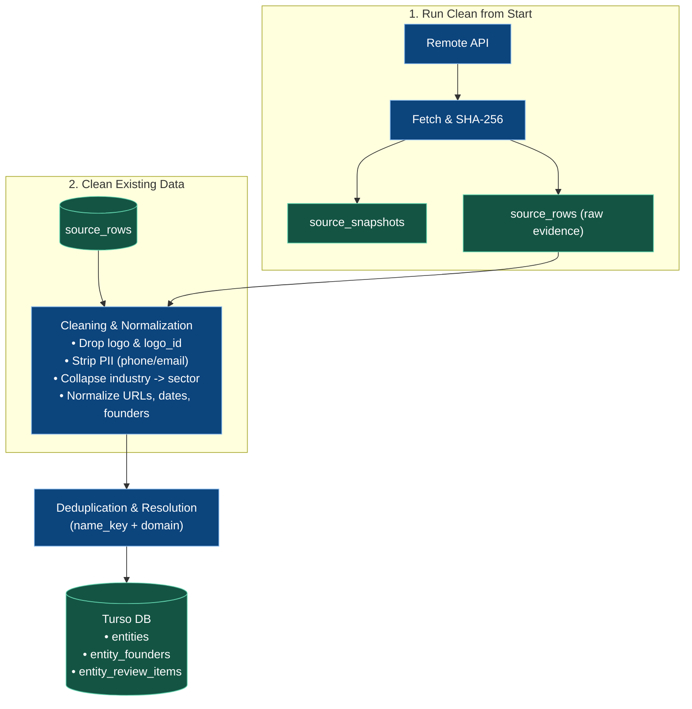

# Athar — DataOps Cleaning Pipeline

> Strict cleaning, normalization, and deduplication rules for the registry dataset.

---

## 1. The Two Operations

### Operation 1: Run Clean from Start
* **Trigger:** "Collect registry" button or scheduled ingest.
* **Flow:** Network fetch $\rightarrow$ SHA-256 check $\rightarrow$ store raw evidence in `source_rows` $\rightarrow$ clean & deduplicate $\rightarrow$ write canonical `entities`.
* **Within-run duplicates:** a row whose `(name_key, domain)` already appeared in the same run is flagged `is_duplicate=1` and queued (`Duplicate of row N`); the row itself is never deleted.

### Operation 2: Clean Existing Data
* **Trigger:** "Clean data" button or offline re-process.
* **Flow:** Read local `source_rows` $\rightarrow$ re-run cleaning rules & deduplication $\rightarrow$ update `entities`.
* **Reconcile pass:** flags exact `(name_key, domain)` duplicates across the whole corpus, backfills `entity_founders` and missing `entities.description` from preserved records, supersedes stale review items on shadow rows, and reports the open review count.
* **Zero Network:** 100% offline, idempotent, safe to run anytime; a repeated run reports 0 new changes.

---

## 2. Field Cleaning Rules

| Source Field | Action | Output Field | Rules |
|---|---|---|---|
| `logo`, `logo_id` | **Drop** | None | Blank placeholders; discarded completely |
| `phone`, `email` | **Drop** | None | PII policy; never stored in product entities |
| `industry` | **Collapse** | `entities.sector` | Identical to `sector`; merged into one column |
| `name` | **Normalize** | `entities.name` `entities.name_key` | Trim whitespace; NFC Unicode; casefold for lookup |
| `website` | **Normalize** | `entities.website` `entities.domain` | Strip scheme/`www`; lowercase; validate valid host |
| `desc` | **Normalize** | `entities.description` | Trim whitespace; preserve concrete product details |
| `label` | **Normalize** | `entities.cohort_label` `entities.cohort_date` | `MM/YYYY` parsed to ISO date (`YYYY-MM-01`) |
| `creation_year` | **Normalize** | `entities.creation_year` | String converted to integer (e.g. `2021`) |
| `founders` | **Relational** | `entity_founders` | Array split, trimmed, blanks removed, linked by `entity_id` |

---

## 3. Deduplication Rules

* **Canonical Key:** `(name_key, domain)`.
* **Match:** Updates `entities` and links latest evidence row.
* **New:** Inserts new canonical startup into `entities`.
* **Conflict:** Name/domain mismatch queued into `entity_review_items` (zero guessing).
* **Duplicate (same key again in one run):** the later row is flagged `is_duplicate=1` on both `source_rows` and `normalized_records`; it stays readable in the Database pane and its review item records the canonical row it duplicates.
* **Suppression:** default views (`records_search`, run metrics) read `is_duplicate=0` only; raw evidence is always preserved and no DELETE ever runs against source rows.

---

## 4. Staged Post-Fill Fields

Fields pre-allocated in `entities`:
* `retrieval_text`: `NULL` until the Prepare operation populates it (cleaned, English translation of the description).
* `detected_language`: `NULL` until the Prepare operation tags the original description's language.
* `is_embedded`: `0` (flipped to `1` when vectorized by local Qwen; embeddings are a later milestone).
* `status_signal`: `NULL` (reserved for R3/R4 lifecycle signals).

---

## 5. Prepare Text Operation

A separate "Prepare text" run (independent of Collect/Clean, shown on the same timeline):

* **Engine:** one Groq call per uncached description (`qwen/qwen3.8-27b`, strict JSON) that detects the original language, removes only subjective marketing fluff, preserves all concrete facts, keeps cleaned text in the source language, and provides a faithful English translation (`cleaned_text` is always retained; English is the translation target).
* **Candidates:** canonical, nonduplicate entities with a non-empty description (`is_duplicate=0`, `latest_row_id` evidence). Rows without a description are skipped; nothing is invented.
* **Cache & provenance:** a `text_preparations` row is keyed by the source row, the sha-256 of the exact description, the provider, the model, and the prompt/schema/target versions. Unchanged descriptions reuse the stored output — including after switching credentials — and are never re-invoked.
* **Evidence checks:** each flagged `fluff_excerpt` must be an exact contiguous quote from the input; lost numeric details invalidate the reply. Outputs are written to `retrieval_text`/`detected_language` only while the entity still points at the exact evidence row and description that produced them.
* **Failures are retryable:** validation failures (malformed/refused/unanchored replies) skip the record and keep it retryable; the run ends as failed and completed work stays. Errors stop the run visibly and retain completed work — there is no paid fallback and no fallback to another model or provider.
* **Credentials & rotation:** Groq keys come from a project-local `dataops/.env.profiles.toml` (`[[profile]]` blocks with `name`, `api_key`, optional `model`); a lone legacy `GROQ_API_KEY`/`GROQ_PROFILE` behaves as a single implicit profile when the file is absent. Keys never leave the file — the `profiles` table registry stores only the name, model, and a partial key fingerprint, and carries the operational state (`disabled`). At most one profile fires per attempt: the least-loaded profile with remaining budget is selected, a `401`/`403` permanently disables that profile (persisted, run continues on the next), and a `429`/`503`/`530` spends that profile's single throttling round (the run rotates to the next). When every remaining profile has already spent its round, or no daily budget remains anywhere, the run stops visibly with "resume later" / "resume after reset" semantics — completed work stays and a later run resumes from the cache. The UI shows the profile list next to the Prepare button; the key itself is never stored or displayed.
* **Data-driven quotas:** each registered profile is seeded free-tier default rows in `dataops_quotas` (task `prepare`): `records_per_day=1000/day`, `tokens_per_day=200000/day`, `requests_per_minute=30/minute`, `estimate_tokens_per_record=1000` (used only when Groq omits token counts). Quotas are ordinary rows the operator can edit directly; the TOML store never carries limits. Cache hits consume no quota. This is DataOps maintainer consumption per profile and task — distinct from the Go backend's end-user `user_usage` quota.
* **Usage tracking:** every attempt is recorded in `preparation_usage` (model, profile, fingerprint, duration, tokens, provider request ID, outcome). When the provider omits token counts, consumption stays explicitly unknown. Missing credentials disable only this operation; collection and cleaning remain fully usable. The Settings pane reports per-profile quota rows, today's usage, and disabled status.

---

## 6. Deduplication & Review Classification

Review findings carry a shared `code`/`category` (`automatic`, `incomplete`, or `human`), so storage and UI agree on meaning:

* **Automatic** (e.g. `exact_duplicate`): handled deterministically, resolved automatically, with the audit reason retained.
* **Incomplete** (e.g. `invalid_website`): shows what is missing without demanding a human decision.
* **Human** (genuine conflicts, e.g. `identity_conflict`, `date_conflict`): the only category that counts toward "records needing review" — and only if unresolved. The LLM never approves identity merges.

Repeated cleaning never reopens already handled issues: inserts are idempotent per (row, reason), and suppressing a shadow row marks its stale reasons resolved instead of deleting them. Existing flags were reclassified in-place by migration 005 without losing source evidence.
