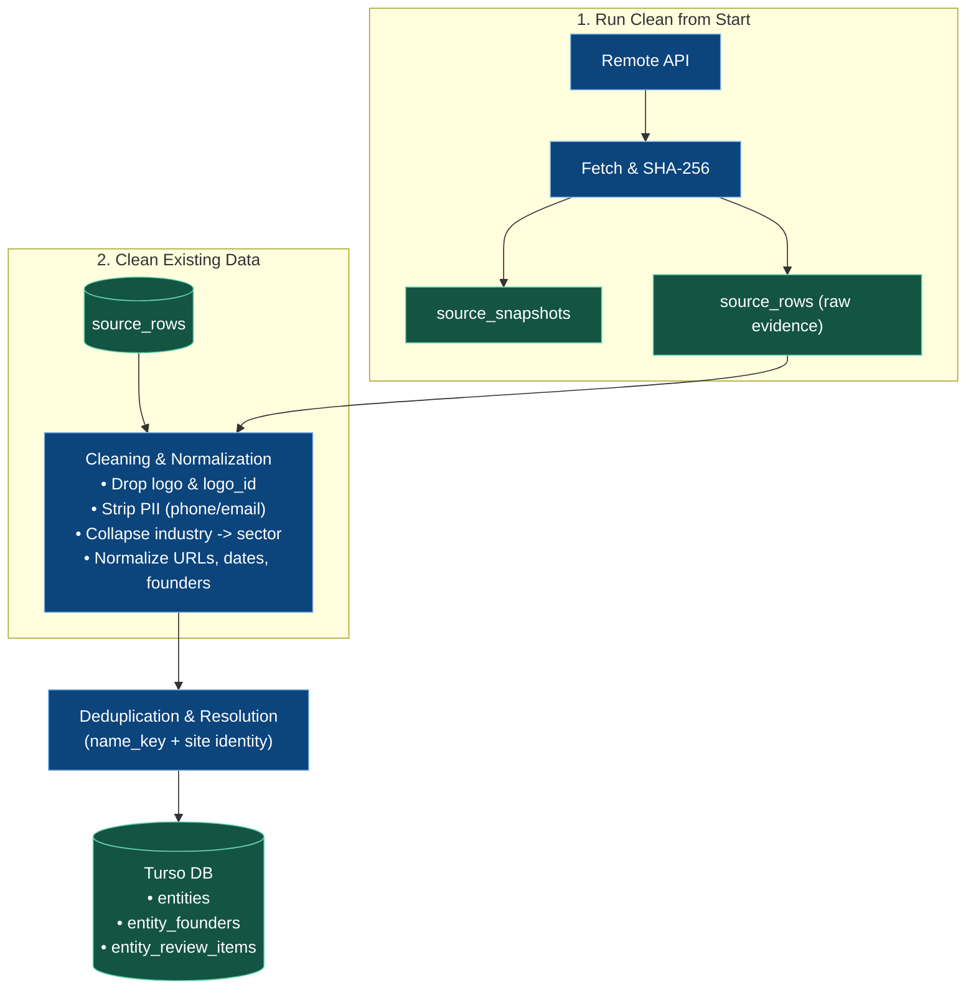

# Athar — DataOps Cleaning Pipeline

> Strict cleaning, normalization, and deduplication rules for the registry dataset.

---

## 1. The Two Operations

```mermaid
flowchart TD
    subgraph PathA["1. Run Clean from Start"]
        API["Remote API"] --> FETCH["Fetch & SHA-256"]
        FETCH --> SNAP["source_snapshots"]
        FETCH --> ROWS["source_rows (raw evidence)"]
    end

    subgraph PathB["2. Clean Existing Data"]
        ROWS_IN[("source_rows")] --> CLEAN
    end

    ROWS --> CLEAN["Cleaning & Normalization<br/>• Drop logo & logo_id<br/>• Strip PII (phone/email)<br/>• Collapse industry -> sector<br/>• Normalize URLs, dates, founders"]

    CLEAN --> DEDUP["Deduplication & Resolution<br/>(name_key + site identity)"]

    DEDUP --> DB[("Turso DB<br/>• entities<br/>• entity_founders<br/>• entity_review_items")]

    classDef stage fill:#0C447C,stroke:#85B7EB,color:#FFFFFF
    classDef store fill:#145443,stroke:#63D5AF,color:#FFFFFF
    class API,FETCH,CLEAN,DEDUP stage
    class SNAP,ROWS,ROWS_IN,DB store
```

### Operation 1: Run Clean from Start
* **Trigger:** "Collect registry" button or scheduled ingest.
* **Flow:** Network fetch $\rightarrow$ SHA-256 check $\rightarrow$ store raw evidence in `source_rows` $\rightarrow$ clean & deduplicate $\rightarrow$ write canonical `entities`.
* **Within-run duplicates:** only content-equivalent rows are flagged `is_duplicate=1`; JSON key order and absent-versus-null placeholders do not count as differences. Every source row remains stored.

### Operation 2: Clean Existing Data
* **Trigger:** "Clean data" button or offline re-process.
* **Flow:** Read `source_rows` from the latest completed collection $\rightarrow$ re-run cleaning rules & deduplication $\rightarrow$ update `entities`. If no collection completed, Clean stops without using a failed snapshot.
* **Reconcile pass:** reapplies current identity and duplicate rules to the latest preserved snapshot, rebuilds founder evidence and related-entry links, resolves stale review reasons with an audit note, and reports the open review count.
* **Zero Network:** 100% offline; it never invokes Groq or replaces preserved source rows.

### Reset before a fresh collection

Run offers a separate, confirmed **Reset registry data** action. It atomically clears source snapshots and rows, normalized records, entities, founders, relations, reviews, embeddings, prepared text, and run history. Groq profiles, quota limits, and usage counts remain; old usage rows lose their deleted source/run links. Collect must then be started manually. The Database tab's broader **Wipe data** action still clears all data except schema migrations.

---

## 2. Field Cleaning Rules

| Source Field | Action | Output Field | Rules |
|---|---|---|---|
| `logo`, `logo_id` | **Drop** | None | Blank placeholders; discarded completely |
| `phone`, `email` | **Drop** | None | PII policy; never stored in product entities |
| `industry` | **Collapse** | `entities.sector` | Identical to `sector`; merged into one column |
| `name` | **Normalize** | `entities.name` `entities.name_key` | Trim whitespace; NFC Unicode; casefold for lookup |
| `website` | **Normalize** | `entities.website` `entities.domain` | Validate the host; accept one unambiguous URL token from a mixed field, but leave competing or malformed URLs in review |
| `desc` | **Normalize** | `entities.description` | Trim whitespace; preserve concrete product details |
| `label` | **Normalize** | `entities.cohort_label` `entities.cohort_date` | `MM/YYYY` parsed to ISO date (`YYYY-MM-01`) |
| `creation_year` | **Normalize** | `entities.creation_year` | String converted to integer (e.g. `2021`) |
| `founders` | **Relational** | `entity_founders` | Array split, trimmed, blanks removed, linked by `entity_id` |

---

## 3. Deduplication Rules

* **Canonical Key:** normalized name plus site identity. Ordinary sites use the host; Facebook and Google Sites use the hosted page path as well.
* **Match:** rows with the same key link to one entity. Distinct descriptions remain visible; the first nonempty description is the main one.
* **New:** a different site identity creates a separate startup. Startups with different names and sites can be marked related when the registry gives the same founding year and a strong overlap of at least two founders.
* **Founders:** agreement across linked registry rows is marked `confirmed across entries`; names present in only some rows are `to confirm`. A sole registry row is `registry reported`. These labels do not independently verify anyone's identity.
* **Duplicate:** a later content-equivalent row is flagged on `source_rows` and `normalized_records` and records its canonical source row in an automatic finding.
* **Suppression:** default views (`records_search`, run metrics) read `is_duplicate=0` only; raw evidence is always preserved and no DELETE ever runs against source rows.

---

## 4. Staged Post-Fill Fields

Fields pre-allocated in `entities`:
* `retrieval_text`: `NULL` until the Prepare operation populates it (cleaned, English translation of the description).
* `detected_language`: `NULL` until the Prepare operation tags the original description's language.
* `is_embedded`: `0` (flipped to `1` when vectorized by local Qwen; embeddings are a later milestone).
* `status_signal`: `NULL` (reserved for R3/R4 lifecycle signals).

---

## 5. Prepare Text Operation

A separate "Prepare all" run (independent of Collect/Clean, shown on the same timeline):

* **Engine:** one Groq call per uncached entity (`qwen/qwen3.8-27b`, strict JSON). A single-description entity gets detection, fluff removal, cleaned original-language text, and an English translation. Multiple distinct descriptions are submitted together as labeled source rows; the output retains a cleaned result per row and adds one English retrieval summary.
* **Candidates:** entities with at least one nonempty description from the current snapshot. Exact duplicate rows are skipped; distinct descriptions remain inputs.
* **Cache & provenance:** input hashes include the ordered set of distinct descriptions; `text_preparation_sources` links the result to each contributing source row. Prepare checks cached output under configured models before reserving quota. A changed description invalidates the entity's published retrieval text until Prepare runs again.
* **Evidence checks:** each flagged `fluff_excerpt` must occur in its source input; lost numeric details invalidate cleaned text, and invented numeric details invalidate a combined summary. Outputs publish only while the entity still points to the same source and input hash.
* **Failures are retryable:** validation failures (malformed/refused/unanchored replies) skip the record and keep it retryable; the run ends as failed and completed work stays. Errors stop the run visibly and retain completed work — there is no paid fallback and no fallback to another model or provider.
* **Credentials & rotation:** Groq keys come from a project-local `dataops/.env.profiles.toml` (`[[profile]]` blocks with `name`, `api_key`, optional `model`); a lone legacy `GROQ_API_KEY`/`GROQ_PROFILE` behaves as a single implicit profile when the file is absent. Keys never leave the file — the `profiles` table registry stores only the name, model, and a partial key fingerprint, and carries the operational state (`disabled`). At most one profile fires per attempt: the least-loaded profile with remaining budget is selected, a `401`/`403` permanently disables that profile (persisted, run continues on the next), and a `429`/`503`/`530` spends that profile's single throttling round (the run rotates to the next). When every remaining profile has already spent its round, or no daily budget remains anywhere, the run stops visibly with "resume later" / "resume after reset" semantics — completed work stays and a later run resumes from the cache. The UI shows the profile list next to the Prepare button; the key itself is never stored or displayed.
* **Data-driven quotas:** each registered profile is seeded free-tier default rows in `dataops_quotas` (task `prepare`): `records_per_day=1000/day`, `tokens_per_day=200000/day`, `requests_per_minute=30/minute`, `estimate_tokens_per_record=1000` (used only when Groq omits token counts). Quotas are ordinary rows the operator can edit directly; the TOML store never carries limits. Cache hits consume no quota. This is DataOps maintainer consumption per profile and task — distinct from the Go backend's end-user `user_usage` quota.
* **Usage tracking:** every attempt is recorded in `preparation_usage` (model, profile, fingerprint, duration, tokens, provider request ID, outcome). When the provider omits token counts, consumption stays explicitly unknown. Missing credentials disable only this operation; collection and cleaning remain fully usable. The Settings pane reports per-profile quota rows, today's usage, and disabled status.

---

## 6. Deduplication & Review Classification

Review findings carry a shared `code`/`category` (`automatic`, `incomplete`, or `human`). The Records **In review** filter, badges, and review count all use unresolved findings on nonduplicate rows. One row counts once even when it has several findings:

* **Automatic** (e.g. `exact_duplicate`, `website_extracted`): handled deterministically, resolved automatically, with the audit reason retained.
* **Incomplete** (e.g. `invalid_website`): an open, nonblocking source gap. The pipeline continues without acknowledgement or approval.
* **Human** (genuine conflicts, e.g. `identity_conflict`, `date_conflict`): an open decision; the LLM never approves identity merges.

If another nonduplicate row of the same confirmed entity supplies a description, its missing-description finding is resolved with that row number as provenance; the original row stays unchanged. Name-only matches do not fill websites or merge entities. Repeated cleaning does not reopen handled findings. Reasons no longer produced by current rules are marked resolved with a note, while source evidence stays intact. Migration 010 reprocesses the latest complete snapshot offline when its stored rows are intact, then backfills description coverage and review counts; no new collection is needed.
